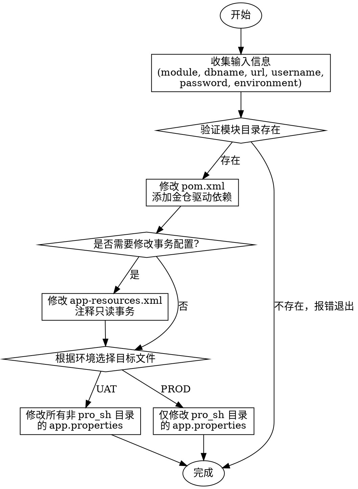

# 翔云数据库切换人大金仓

将指定模块的数据库配置从任意数据库（MySQL、Oracle、PostgreSQL 等）切换到人大金仓（KingbaseES）数据库。

## 输入信息收集

执行前必须向用户确认以下信息：

| 参数 | 说明 | 示例 |
|------|------|------|
| `module` | 目标模块名称 | `amq`,`bpm`,`cas`,`cm`,`crm`,`cross`,`ct`,`dc`,`dm`,`fm`,`fme`,`fo`,`im`,`image`,`mdm`,`mkt`,`mm`,`mobile`,`odp`,`phone`,`pm`,`rp`,`sd`,`sm`,`uc`,`ws` |
| `dbname` | 数据库名称（URL 中的 database 部分） | `amq`, `bpm`, `crm` |
| `url` | 金仓数据库连接地址 | `jdbc:kingbase8://10.195.1.130:54342/dbname` |
| `username` | 数据库用户名 | `amq` |
| `password` | 数据库密码 | `your_password` |
| `environment` | 目标环境 | `UAT` 或 `PROD` |


## 环境与文件映射

```
{module}/{module}-svc/src/main/package/
├── dev/app.properties          # UAT 环境
├── test/app.properties         # UAT 环境
├── sit/app.properties          # UAT 环境
├── uat/app.properties          # UAT 环境
├── pre/app.properties          # UAT 环境
├── pro_sh/app.properties       # PROD 环境（仅此目录）
└── pro/app.properties          # UAT 环境
```

**环境选择规则：**
- `UAT` → 修改所有目录 **除了** `pro_sh`
- `PROD` → **仅** 修改 `pro_sh` 目录

## 执行步骤

### 1. 添加金仓 JDBC 驱动依赖

修改 `{module}/{module}-svc/pom.xml`，在 `<dependencies>` 中添加：

```xml
<dependency>
    <groupId>com.kingbase8</groupId>
    <artifactId>kingbase8-jdbc</artifactId>
</dependency>
```

### 2. 修改事务配置（可选）

修改 `{module}/{module}-svc/src/main/resources/app-resources.xml`：

```xml
<!-- 注释掉只读事务配置（如存在） -->
<!-- <tx:method name="get*" read-only="true"/> -->
<!-- <tx:method name="update" read-only="true"/> -->
<!-- <tx:method name="find*" read-only="true"/> -->
<tx:method name="*" isolation="DEFAULT"/>
```

**注意**：此步骤需根据实际业务需求决定是否执行，某些模块可能不需要。

### 3. 修改 app.properties 文件

根据环境选择目标文件，修改以下配置项为金仓配置：

| 配置项 | 目标值 (KingbaseES) |
|--------|---------------------|
| `jdbc.dbType` | `kingbase` |
| `jdbc.driverClassName` | `com.kingbase8.Driver` |
| `jdbc.url` | `jdbc:kingbase8://{host}:{port}/{dbname}` |
| `jdbc.urlo` | 与 jdbc.url 相同 |
| `jdbc.username` | 用户提供的用户名 |
| `jdbc.password` | 用户提供的密码 |

## 配置修改示例

### MySQL → KingbaseES

```properties
# 修改前 (MySQL)
jdbc.dbType=mysql
jdbc.driverClassName=com.mysql.jdbc.Driver
jdbc.url=jdbc:mysql://10.195.1.130:3338/amq?useUnicode=true&characterEncoding=UTF-8
jdbc.username=amq
jdbc.password=amq20170804

# 修改后 (KingbaseES)
jdbc.dbType=kingbase
jdbc.driverClassName=com.kingbase8.Driver
jdbc.url=jdbc:kingbase8://10.195.1.130:54342/fm_main
jdbc.urlo=jdbc:kingbase8://10.195.1.130:54342/fm_main
jdbc.username=amq
jdbc.password=your_password
```

### Oracle → KingbaseES

```properties
# 修改前 (Oracle)
jdbc.dbType=oracle
jdbc.driverClassName=oracle.jdbc.driver.OracleDriver
jdbc.url=jdbc:oracle:thin:@10.195.1.130:1521:orcl
jdbc.username=amq
jdbc.password=amq20170804

# 修改后 (KingbaseES)
jdbc.dbType=kingbase
jdbc.driverClassName=com.kingbase8.Driver
jdbc.url=jdbc:kingbase8://10.195.1.130:54342/amq
jdbc.urlo=jdbc:kingbase8://10.195.1.130:54342/amq
jdbc.username=amq
jdbc.password=your_password
```

### PostgreSQL → KingbaseES

```properties
# 修改前 (PostgreSQL)
jdbc.dbType=postgresql
jdbc.driverClassName=org.postgresql.Driver
jdbc.url=jdbc:postgresql://10.195.1.130:5432/amq
jdbc.username=amq
jdbc.password=amq20170804

# 修改后 (KingbaseES)
jdbc.dbType=kingbase
jdbc.driverClassName=com.kingbase8.Driver
jdbc.url=jdbc:kingbase8://10.195.1.130:54342/amq
jdbc.urlo=jdbc:kingbase8://10.195.1.130:54342/amq
jdbc.username=amq
jdbc.password=your_password
```

## 执行流程



## 注意事项

1. **密码安全**：密码应考虑一定复杂度。
2. **环境隔离**：UAT 和 PROD 环境的数据库地址可能不同，确认后再执行
3. **事务配置**：注释只读事务是可选操作，取决于业务是否需要
4. **备份建议**：修改前建议用户确认是否需要备份原配置
5. **源数据库无关**：本操作适用于从 MySQL、Oracle、PostgreSQL 等任意数据库切换
